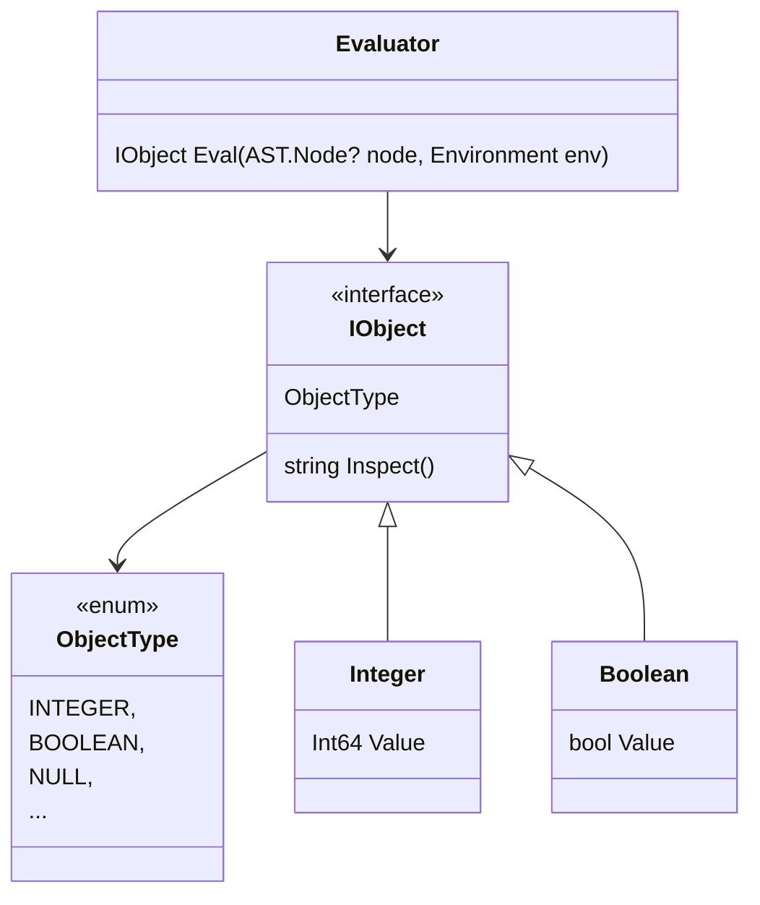

# Evaluator

The evaluator will take an AST and "run" it to produce a value. It has it's own types to represent values.

AST nodes are evaluated in an `Environment`, which is basically a dictionary holding the values (`IObject`) represented by variable names (`Identifier`).



Try it out:

```
$ dotnet run eval
Hello, Monkeys!
Feel free to type in commands
>> 2 * 2 + 5 * 5

29

>> let x = 9

9

>> x * 2

18
```

## Your assignment

Implement the evaluation of functions and function calls.

1. Implement a `Function` object type. It needs to have:
    - a list of Identifiers representing the parameters
    - a `BlockStatement` holding the body of the function
    - an `Environment`
1. Add a case in `Eval()` for the `FunctionLiteral` AST node. Making the Function object from the AST node is very easy.

It should now be possible to evaluate functions:

```
>> let f = fn(x) { x }

fn(x) { x; }

>> f

fn(x) { x; }
```

Now we only need to be able to call functions...

3. Add a case in `Eval()` for the `CallExpression` AST node.
    - You first have to evaluate the function expression to get the actual Function object
    - You then have to evaluate all arguments
    - Finally you apply the function to the arguments. To do this you evaluate the function body, but you do it in a new Environment where you add the parameter values. The Environment object has a method for creating such an environment.

If you managed this, you should be able to do stuff like:

```
>> fn(x) { x * x * x }(2)

8

>> let f = fn() { 100 }

fn() { 100; }

>> f()

100

>> let g = fn(a, b) { if (a>b) { a } else { b } }

fn(a, b) { if ((a > b)) { a; } else { b; }; }

>> g(1, 2)

2

>> g(99, f())

100

```

And even higher level function stuff like this:

```

>> let foo = fn(f) { fn(x) { f(x) } }

fn(f) { fn(x) { f(x); }; }

>> foo(fn(n) { n + 1 })(99)

100
```

And if you did the Environment stuff correctly the functions are also closures:

```
>> let x = 100

100

>> let f = fn(y) { x + y }

fn(y) { (x + y); }

>> f(5)

105
```

Finally, let's see some errors:

```
>> abc(100)

ERROR: identifier not found: abc

>> let abc = fn(x) { x }

fn(x) { x; }

>> abc(z)

ERROR: identifier not found: z

>> let x = true

True

>> x(10)

ERROR: not a function: BOOLEAN

```