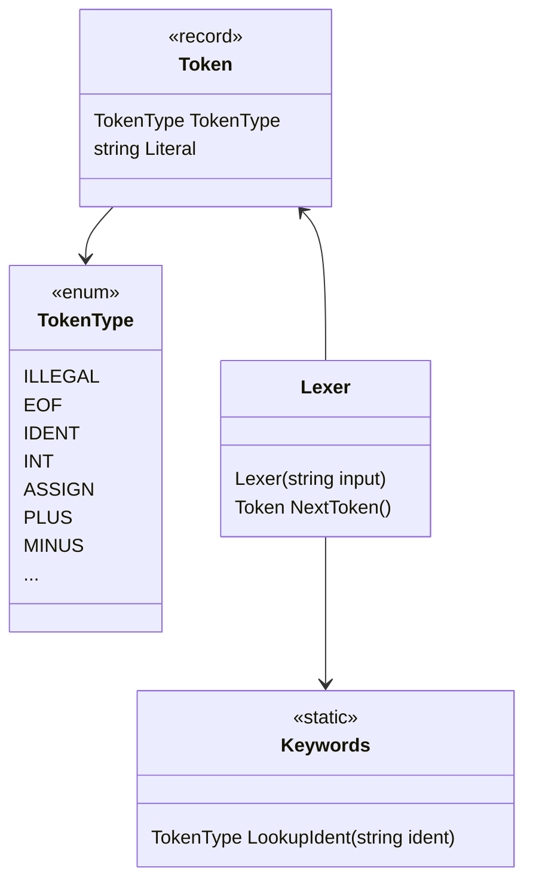

# Lexer

The Lexer will read a string of source code. You can then consume all the tokens by calling the `NextToken()` method until you get to the `EOF` token.

You can run Monkey in *lex* mode to output the tokens, like this:

```
$ dotnet run lex
Hello, Monkeys!
Feel free to type in commands

>> if (foo > 99) { true }

Token { TokenType = IF, Literal = if }
Token { TokenType = LPAREN, Literal = ( }
Token { TokenType = IDENT, Literal = foo }
Token { TokenType = GT, Literal = > }
Token { TokenType = INT, Literal = 99 }
Token { TokenType = RPAREN, Literal = ) }
Token { TokenType = LBRACE, Literal = { }
Token { TokenType = TRUE, Literal = true }
Token { TokenType = RBRACE, Literal = } }
Token { TokenType = EOF, Literal =  }
```

## Class diagram



## Your assignment

Currently the lexer can't produce FUNCTION tokens. Lexing this function expression:

```
fn(n) { n * 2 }
```

should produce these tokens:

```
Token { TokenType = FUNCTION, Literal = fn }
Token { TokenType = LPAREN, Literal = ( }
Token { TokenType = IDENT, Literal = n }
Token { TokenType = RPAREN, Literal = ) }
Token { TokenType = LBRACE, Literal = { }
Token { TokenType = IDENT, Literal = n }
Token { TokenType = ASTERISK, Literal = * }
Token { TokenType = INT, Literal = 2 }
Token { TokenType = RBRACE, Literal = } }
Token { TokenType = EOF, Literal =  }
```