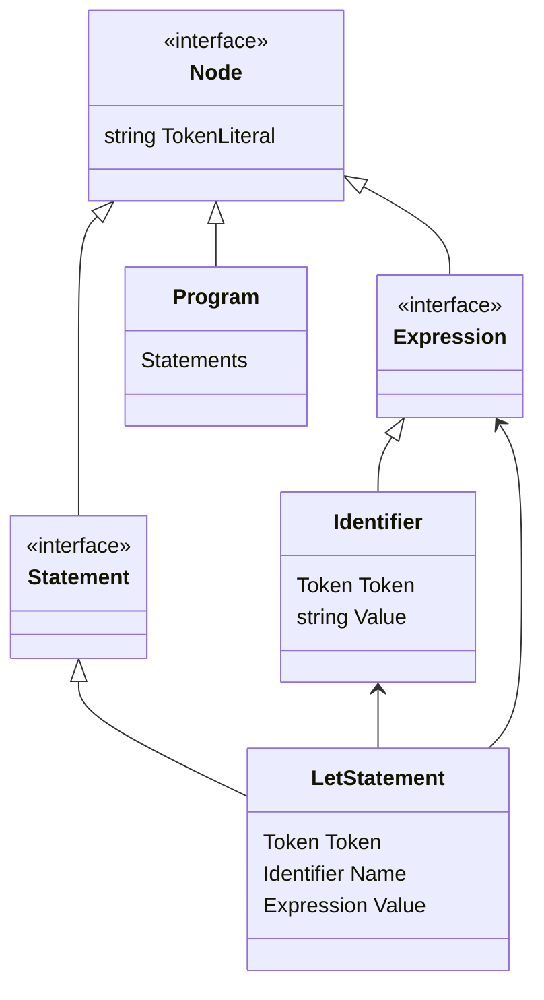
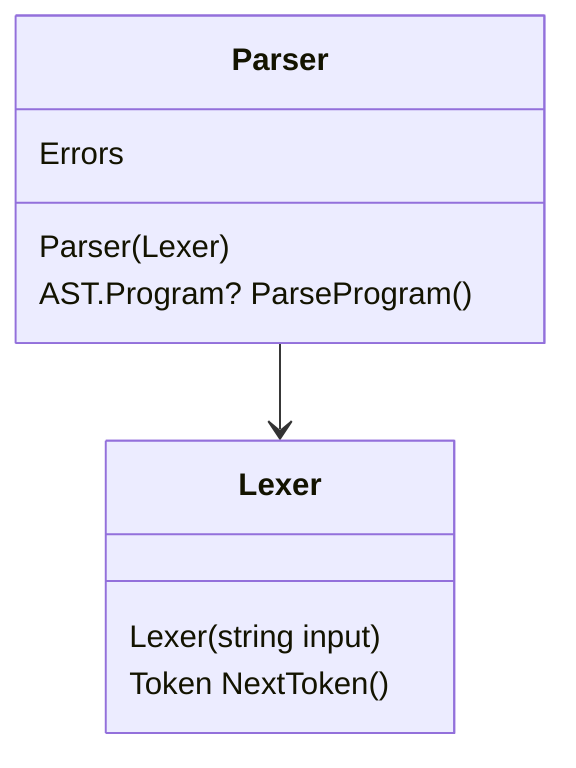

# Parser

The Parser will use a Lexer to get tokens from Monkey source code, and then build an Abstract Syntax Three representation (AST).

When running Monkey in *parse* mode, `ToString()` will be called on the AST to produce the canonical representation of the source:

```
$ dotnet run parse
Hello, Monkeys!
Feel free to type in commands

>> let foo = 1 + 2

let foo = (1 + 2);
```

If there are any syntactical errors in the input, the parser should catch them:

```
>> let foo 12

1 parse error(s):
expected next token to be ASSIGN, got INT instead
```

## The AST

Study the AST data model and see how it can represent a program. Here is a partial diagram



## Parser class diagram

Now study the Parser and see how it walks the token stream to produce the correct AST nodes.



## Your assignment

Currently the parser can't parse functions.

1. Create a `FunctionLiteral` expression type in `Monkey.AST`. It must have properties to hold the parameter expressions and the method body. Also remember to override `ToString()`.
1. Enhance `Parser` to parse functions. 
    - Hint: Add a method `ParseFunctionLiteral()`, register it in `prefixParseFunctions`.

When you are done, running in *parse* mode Monkey should be able to parse functions something like this:

```
>> fn () { true }

fn() { true; }

>> fn (x) { x }

fn(x) { x; }

>> fn (n, m) { n; m; n + m }

fn(n, m) { n;m;(n + m); }
```

And some bad input:

```
>> fn { 100 }

3 parse error(s):
expected next token to be LPAREN, got LBRACE instead
no prefix parse function for LBRACE found
no prefix parse function for RBRACE found

>> fn() true

1 parse error(s):
expected next token to be LBRACE, got TRUE instead
```

3. Next, add the possibility to add a function call. Create a `CallExpression` type for the AST. It should have a function (which can be any expression) and a list of arguments (also any expressions).
3. Extend the parser to parse function calls.
    - Hint: Add a method `Expression ParseCallFunction(Expression function)` and register it in `infixParseFunctions`. But for what token type???

When you are done, the parser should understand function calls:

```
>> foo()

foo()

>> foo(1, 2, 3)

foo(1, 2, 3)

>> fn(x){ x + x }(100)

fn(x) { (x + x); }(100)

>> foo(1, x, if(y) { 1 } else { -1 })

foo(1, x, if (y) { 1; } else { (-1); })
```

The parser should catch issues like these:

```
>> foo(let x = 100)

4 parse error(s):
no prefix parse function for LET found
expected next token to be RPAREN, got IDENT instead
no prefix parse function for ASSIGN found
no prefix parse function for RPAREN found

>> foo(

2 parse error(s):
no prefix parse function for EOF found
expected next token to be RPAREN, got EOF instead
```